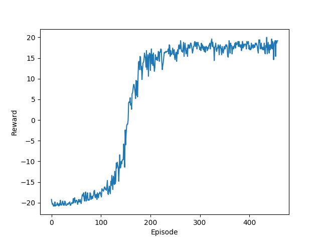

# Deep Q-Network for Atari

Implements the deep Q-network in [Mnih et al, 2015](https://www.nature.com/articles/nature14236) for learning to play Atari games from raw images, with some minor adjustments, particularly use of Adam optimizer instead of rmsprop for increased training stability.

The agent in action:  

Sample training curve for Pong:  

